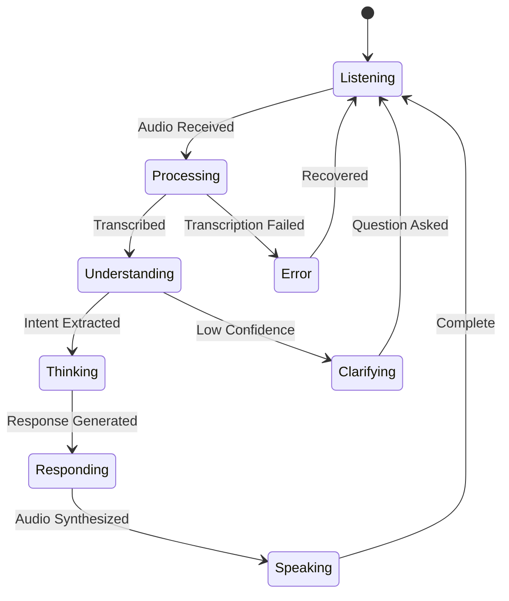

# AI Agent Configuration for Voice Mode

## Overview

This document defines the AI agent architecture, behavior patterns, and integration strategies for the Voice Mode system.

## Agent Architecture

### Multi-Agent System Design

```
┌────────────────────────────────────────────────────────────────┐
│                     Voice Mode Agent System                      │
├────────────────────────────────────────────────────────────────┤
│                                                                  │
│  ┌──────────────────────────────────────────────────────────┐  │
│  │                   Orchestrator Agent                      │  │
│  │  - Session management                                     │  │
│  │  - Agent coordination                                     │  │
│  │  - Context switching                                      │  │
│  └──────────────────────────────────────────────────────────┘  │
│                              │                                   │
│        ┌─────────────────────┼─────────────────────┐           │
│        │                     │                     │           │
│  ┌─────────────┐      ┌─────────────┐      ┌─────────────┐   │
│  │  STT Agent  │      │  NLU Agent  │      │  TTS Agent  │   │
│  │             │      │             │      │             │   │
│  │ - Whisper   │      │ - Intent    │      │ - OpenAI    │   │
│  │ - Streaming │      │ - Entities  │      │ - Caching   │   │
│  │ - Language  │      │ - Context   │      │ - Voices    │   │
│  └─────────────┘      └─────────────┘      └─────────────┘   │
│                                                                  │
│  ┌─────────────┐      ┌─────────────┐      ┌─────────────┐   │
│  │Claude Agent │      │Command Agent│      │Memory Agent │   │
│  │             │      │             │      │             │   │
│  │ - Reasoning │      │ - Execution │      │ - Storage   │   │
│  │ - Response  │      │ - Validation│      │ - Retrieval │   │
│  │ - Learning  │      │ - Security  │      │ - Context   │   │
│  └─────────────┘      └─────────────┘      └─────────────┘   │
│                                                                  │
└────────────────────────────────────────────────────────────────┘
```

## Agent Definitions

### 1. Orchestrator Agent

```typescript
interface IOrchestratorAgent {
  // Lifecycle
  initialize(): Promise<void>;
  shutdown(): Promise<void>;
  
  // Session Management
  createSession(userId: string, config: SessionConfig): Promise<Session>;
  routeMessage(sessionId: string, message: Message): Promise<Response>;
  
  // Agent Coordination
  delegateToAgent(agentType: AgentType, task: Task): Promise<Result>;
  aggregateResponses(responses: Response[]): Promise<FinalResponse>;
}

class OrchestratorAgent implements IOrchestratorAgent {
  private agents: Map<AgentType, IAgent>;
  private sessions: Map<string, Session>;
  private messageQueue: Queue<Message>;
  
  async initialize(): Promise<void> {
    // Initialize all sub-agents
    this.agents.set(AgentType.STT, new STTAgent());
    this.agents.set(AgentType.NLU, new NLUAgent());
    this.agents.set(AgentType.TTS, new TTSAgent());
    this.agents.set(AgentType.CLAUDE, new ClaudeAgent());
    this.agents.set(AgentType.COMMAND, new CommandAgent());
    this.agents.set(AgentType.MEMORY, new MemoryAgent());
    
    // Initialize each agent
    await Promise.all(
      Array.from(this.agents.values()).map(agent => agent.initialize())
    );
  }
  
  async routeMessage(sessionId: string, message: Message): Promise<Response> {
    const session = this.sessions.get(sessionId);
    if (!session) throw new Error('Session not found');
    
    // Determine routing strategy
    const strategy = this.determineRoutingStrategy(message);
    
    // Execute strategy
    switch (strategy) {
      case RoutingStrategy.SEQUENTIAL:
        return this.executeSequential(session, message);
      case RoutingStrategy.PARALLEL:
        return this.executeParallel(session, message);
      case RoutingStrategy.CONDITIONAL:
        return this.executeConditional(session, message);
    }
  }
  
  private async executeSequential(
    session: Session, 
    message: Message
  ): Promise<Response> {
    // STT → NLU → Claude → TTS pipeline
    const transcript = await this.agents.get(AgentType.STT).process(message);
    const intent = await this.agents.get(AgentType.NLU).process(transcript);
    const response = await this.agents.get(AgentType.CLAUDE).process(intent);
    const audio = await this.agents.get(AgentType.TTS).process(response);
    
    return { transcript, intent, response, audio };
  }
}
```

### 2. STT Agent

```typescript
interface ISTTAgent extends IAgent {
  transcribe(audio: AudioData): Promise<Transcript>;
  detectLanguage(audio: AudioData): Promise<Language>;
  streamTranscribe(stream: AudioStream): AsyncIterable<PartialTranscript>;
}

class STTAgent implements ISTTAgent {
  private whisperService: WhisperService;
  private languageDetector: LanguageDetector;
  private cache: TranscriptCache;
  
  async process(input: AudioData): Promise<Transcript> {
    // Check cache
    const cached = await this.cache.get(input);
    if (cached) return cached;
    
    // Detect language
    const language = await this.detectLanguage(input);
    
    // Transcribe with appropriate model
    const model = this.selectModel(language, input.duration);
    const transcript = await this.whisperService.transcribe(input, {
      model,
      language,
      task: 'transcribe'
    });
    
    // Post-process
    const processed = await this.postProcess(transcript);
    
    // Cache result
    await this.cache.set(input, processed);
    
    return processed;
  }
  
  private selectModel(language: Language, duration: number): WhisperModel {
    // Use larger model for longer audio or difficult languages
    if (duration > 30 || this.isDifficultLanguage(language)) {
      return WhisperModel.LARGE_V3;
    }
    return WhisperModel.BASE;
  }
  
  private async postProcess(transcript: Transcript): Promise<Transcript> {
    // Apply corrections
    transcript.text = await this.correctCommonErrors(transcript.text);
    
    // Add punctuation if missing
    if (!this.hasPunctuation(transcript.text)) {
      transcript.text = await this.addPunctuation(transcript.text);
    }
    
    // Normalize text
    transcript.text = this.normalizeText(transcript.text);
    
    return transcript;
  }
}
```

### 3. NLU Agent

```typescript
interface INLUAgent extends IAgent {
  extractIntent(text: string): Promise<Intent>;
  extractEntities(text: string): Promise<Entity[]>;
  classifyCommand(text: string): Promise<CommandType>;
}

class NLUAgent implements INLUAgent {
  private intentClassifier: IntentClassifier;
  private entityExtractor: EntityExtractor;
  private contextManager: ContextManager;
  
  async process(input: Transcript): Promise<NLUResult> {
    // Extract intent
    const intent = await this.extractIntent(input.text);
    
    // Extract entities
    const entities = await this.extractEntities(input.text);
    
    // Classify if it's a command
    const commandType = await this.classifyCommand(input.text);
    
    // Update context
    await this.contextManager.update({
      text: input.text,
      intent,
      entities
    });
    
    return {
      intent,
      entities,
      commandType,
      confidence: this.calculateConfidence(intent, entities),
      context: await this.contextManager.getContext()
    };
  }
  
  private async extractIntent(text: string): Promise<Intent> {
    // Use pattern matching for known intents
    const patterns = [
      { pattern: /create .* component/i, intent: 'CREATE_COMPONENT' },
      { pattern: /explain .* code/i, intent: 'EXPLAIN_CODE' },
      { pattern: /debug .* error/i, intent: 'DEBUG_ERROR' },
      { pattern: /refactor .*/i, intent: 'REFACTOR_CODE' }
    ];
    
    for (const { pattern, intent } of patterns) {
      if (pattern.test(text)) {
        return { type: intent, confidence: 0.9 };
      }
    }
    
    // Fall back to ML classifier
    return this.intentClassifier.classify(text);
  }
}
```

### 4. Claude Agent

```typescript
interface IClaudeAgent extends IAgent {
  generateResponse(context: Context): Promise<ClaudeResponse>;
  executeTools(tools: Tool[]): Promise<ToolResults>;
  learnFromFeedback(feedback: Feedback): Promise<void>;
}

class ClaudeAgent implements IClaudeAgent {
  private claudeClient: ClaudeClient;
  private toolExecutor: ToolExecutor;
  private learningEngine: LearningEngine;
  
  async process(input: NLUResult): Promise<ClaudeResponse> {
    // Build context
    const context = await this.buildContext(input);
    
    // Generate response
    const response = await this.generateResponse(context);
    
    // Execute any tools if needed
    if (response.toolCalls) {
      const toolResults = await this.executeTools(response.toolCalls);
      response.toolResults = toolResults;
    }
    
    // Learn from interaction
    await this.learningEngine.recordInteraction({
      input,
      response,
      timestamp: Date.now()
    });
    
    return response;
  }
  
  private async buildContext(input: NLUResult): Promise<Context> {
    // Get conversation history
    const history = await this.getConversationHistory(input.sessionId);
    
    // Get relevant memories
    const memories = await this.memoryAgent.retrieve(input.intent);
    
    // Get current code context
    const codeContext = await this.getCodeContext();
    
    return {
      input: input.text,
      intent: input.intent,
      entities: input.entities,
      history,
      memories,
      codeContext,
      systemPrompt: this.getSystemPrompt(input.intent)
    };
  }
  
  private getSystemPrompt(intent: Intent): string {
    const prompts = {
      CREATE_COMPONENT: `You are a React component expert. Generate clean, 
                         reusable components with TypeScript and proper styling.`,
      EXPLAIN_CODE: `You are a code explainer. Provide clear, concise 
                     explanations suitable for the user's expertise level.`,
      DEBUG_ERROR: `You are a debugging expert. Analyze errors systematically 
                    and provide actionable solutions.`,
      REFACTOR_CODE: `You are a refactoring expert. Improve code quality 
                      while maintaining functionality.`
    };
    
    return prompts[intent.type] || 'You are a helpful coding assistant.';
  }
}
```

### 5. TTS Agent

```typescript
interface ITTSAgent extends IAgent {
  synthesize(text: string, voice?: Voice): Promise<AudioData>;
  streamSynthesize(text: string): AsyncIterable<AudioChunk>;
  preloadCommonResponses(): Promise<void>;
}

class TTSAgent implements ITTSAgent {
  private openAITTS: OpenAITTSService;
  private audioCache: AudioCache;
  private voiceSelector: VoiceSelector;
  
  async process(input: ClaudeResponse): Promise<AudioData> {
    // Select appropriate voice
    const voice = await this.voiceSelector.select({
      emotion: input.emotion,
      context: input.context,
      userPreference: input.userVoicePreference
    });
    
    // Check cache
    const cacheKey = this.getCacheKey(input.text, voice);
    const cached = await this.audioCache.get(cacheKey);
    if (cached) return cached;
    
    // Synthesize audio
    const audio = await this.synthesize(input.text, voice);
    
    // Post-process audio
    const processed = await this.postProcessAudio(audio, {
      speed: input.speechRate || 1.0,
      pitch: input.pitch || 0,
      emphasis: input.emphasis
    });
    
    // Cache result
    await this.audioCache.set(cacheKey, processed);
    
    return processed;
  }
  
  private async postProcessAudio(
    audio: AudioData, 
    params: AudioParams
  ): Promise<AudioData> {
    let processed = audio;
    
    // Adjust speed
    if (params.speed !== 1.0) {
      processed = await this.adjustSpeed(processed, params.speed);
    }
    
    // Adjust pitch
    if (params.pitch !== 0) {
      processed = await this.adjustPitch(processed, params.pitch);
    }
    
    // Add emphasis
    if (params.emphasis) {
      processed = await this.addEmphasis(processed, params.emphasis);
    }
    
    // Normalize volume
    processed = await this.normalizeVolume(processed);
    
    return processed;
  }
}
```

### 6. Command Agent

```typescript
interface ICommandAgent extends IAgent {
  validateCommand(command: Command): Promise<ValidationResult>;
  executeCommand(command: Command): Promise<ExecutionResult>;
  rollbackCommand(commandId: string): Promise<void>;
}

class CommandAgent implements ICommandAgent {
  private commandRegistry: CommandRegistry;
  private permissionManager: PermissionManager;
  private executionEngine: ExecutionEngine;
  
  async process(input: Command): Promise<ExecutionResult> {
    // Validate command
    const validation = await this.validateCommand(input);
    if (!validation.isValid) {
      throw new CommandValidationError(validation.errors);
    }
    
    // Check permissions
    const hasPermission = await this.permissionManager.check(
      input.userId,
      input.type
    );
    if (!hasPermission) {
      throw new PermissionDeniedError(input.type);
    }
    
    // Execute command
    const result = await this.executeCommand(input);
    
    // Record for potential rollback
    await this.recordExecution(input, result);
    
    return result;
  }
  
  async executeCommand(command: Command): Promise<ExecutionResult> {
    const handler = this.commandRegistry.getHandler(command.type);
    
    if (!handler) {
      throw new Error(`No handler for command: ${command.type}`);
    }
    
    try {
      // Pre-execution hooks
      await this.runPreExecutionHooks(command);
      
      // Execute
      const result = await handler.execute(command);
      
      // Post-execution hooks
      await this.runPostExecutionHooks(command, result);
      
      return {
        success: true,
        commandId: command.id,
        result,
        timestamp: Date.now()
      };
    } catch (error) {
      // Attempt rollback if needed
      if (this.shouldRollback(error)) {
        await this.rollbackCommand(command.id);
      }
      
      throw error;
    }
  }
}
```

### 7. Memory Agent

```typescript
interface IMemoryAgent extends IAgent {
  store(memory: Memory): Promise<void>;
  retrieve(query: Query): Promise<Memory[]>;
  forget(criteria: ForgetCriteria): Promise<void>;
}

class MemoryAgent implements IMemoryAgent {
  private vectorStore: VectorStore;
  private graphDatabase: GraphDatabase;
  private memoryIndex: MemoryIndex;
  
  async process(input: MemoryOperation): Promise<MemoryResult> {
    switch (input.type) {
      case 'STORE':
        return this.store(input.memory);
      case 'RETRIEVE':
        return this.retrieve(input.query);
      case 'FORGET':
        return this.forget(input.criteria);
      case 'UPDATE':
        return this.update(input.memoryId, input.updates);
    }
  }
  
  async store(memory: Memory): Promise<void> {
    // Generate embedding
    const embedding = await this.generateEmbedding(memory.content);
    
    // Store in vector database
    await this.vectorStore.insert({
      id: memory.id,
      embedding,
      metadata: memory.metadata
    });
    
    // Update graph relationships
    await this.graphDatabase.createNode({
      id: memory.id,
      type: memory.type,
      properties: memory.properties
    });
    
    // Update index
    await this.memoryIndex.index(memory);
  }
  
  async retrieve(query: Query): Promise<Memory[]> {
    // Generate query embedding
    const queryEmbedding = await this.generateEmbedding(query.text);
    
    // Search vector store
    const vectorResults = await this.vectorStore.search(
      queryEmbedding,
      query.limit || 10
    );
    
    // Search graph for relationships
    const graphResults = await this.graphDatabase.traverse(
      query.startNode,
      query.relationship
    );
    
    // Combine and rank results
    const combined = this.combineResults(vectorResults, graphResults);
    
    // Apply filters
    const filtered = this.applyFilters(combined, query.filters);
    
    return filtered;
  }
}
```

## Agent Communication Protocol

### Message Format

```typescript
interface AgentMessage {
  id: string;
  from: AgentType;
  to: AgentType;
  type: MessageType;
  payload: any;
  timestamp: number;
  correlationId?: string;
  priority: Priority;
}

enum MessageType {
  REQUEST = 'request',
  RESPONSE = 'response',
  EVENT = 'event',
  ERROR = 'error',
  HEARTBEAT = 'heartbeat'
}

enum Priority {
  LOW = 0,
  NORMAL = 1,
  HIGH = 2,
  CRITICAL = 3
}
```

### Communication Patterns

#### 1. Request-Response
```typescript
class AgentCommunicator {
  async requestResponse(
    from: IAgent,
    to: IAgent,
    request: Request
  ): Promise<Response> {
    const message: AgentMessage = {
      id: generateId(),
      from: from.type,
      to: to.type,
      type: MessageType.REQUEST,
      payload: request,
      timestamp: Date.now(),
      priority: request.priority || Priority.NORMAL
    };
    
    // Send message
    await this.send(message);
    
    // Wait for response
    return this.waitForResponse(message.id, request.timeout);
  }
}
```

#### 2. Publish-Subscribe
```typescript
class EventBus {
  private subscribers: Map<EventType, Set<IAgent>>;
  
  subscribe(event: EventType, agent: IAgent): void {
    if (!this.subscribers.has(event)) {
      this.subscribers.set(event, new Set());
    }
    this.subscribers.get(event).add(agent);
  }
  
  async publish(event: Event): Promise<void> {
    const subscribers = this.subscribers.get(event.type) || new Set();
    
    await Promise.all(
      Array.from(subscribers).map(agent => 
        agent.handleEvent(event)
      )
    );
  }
}
```

#### 3. Pipeline
```typescript
class Pipeline {
  private stages: IAgent[];
  
  async execute(input: any): Promise<any> {
    let result = input;
    
    for (const agent of this.stages) {
      result = await agent.process(result);
      
      // Allow early exit
      if (result.shouldStop) {
        break;
      }
    }
    
    return result;
  }
}
```

## Agent Behaviors

### Conversation Flow



### Decision Trees

```typescript
class DecisionEngine {
  async makeDecision(context: Context): Promise<Decision> {
    // High-level decision tree
    if (context.isCommand) {
      return this.handleCommand(context);
    }
    
    if (context.isQuestion) {
      return this.handleQuestion(context);
    }
    
    if (context.isStatement) {
      return this.handleStatement(context);
    }
    
    return this.handleUnknown(context);
  }
  
  private async handleCommand(context: Context): Promise<Decision> {
    if (context.confidence < 0.7) {
      return { action: 'CONFIRM', message: 'Did you mean to...?' };
    }
    
    if (!context.hasPermission) {
      return { action: 'REQUEST_PERMISSION', message: 'I need permission to...' };
    }
    
    return { action: 'EXECUTE', command: context.command };
  }
}
```

## Learning & Adaptation

### Feedback Loop

```typescript
class LearningEngine {
  private feedbackStore: FeedbackStore;
  private modelUpdater: ModelUpdater;
  
  async learn(interaction: Interaction): Promise<void> {
    // Collect implicit feedback
    const implicitFeedback = this.extractImplicitFeedback(interaction);
    
    // Store feedback
    await this.feedbackStore.store({
      interactionId: interaction.id,
      implicit: implicitFeedback,
      explicit: interaction.explicitFeedback
    });
    
    // Update models if threshold reached
    if (await this.shouldUpdateModels()) {
      await this.updateModels();
    }
  }
  
  private extractImplicitFeedback(interaction: Interaction): ImplicitFeedback {
    return {
      // User continued conversation (positive signal)
      continued: interaction.followUpMessages > 0,
      
      // User repeated request (negative signal)
      repeated: interaction.repetitions > 0,
      
      // Response time (engagement signal)
      responseTime: interaction.userResponseTime,
      
      // Completion rate
      taskCompleted: interaction.taskStatus === 'completed'
    };
  }
}
```

### Personalization

```typescript
class PersonalizationEngine {
  async personalizeResponse(
    response: Response,
    userProfile: UserProfile
  ): Promise<Response> {
    // Adjust formality
    response.text = this.adjustFormality(
      response.text,
      userProfile.formalityPreference
    );
    
    // Adjust verbosity
    response.text = this.adjustVerbosity(
      response.text,
      userProfile.verbosityPreference
    );
    
    // Select voice
    response.voice = this.selectVoice(userProfile.voicePreference);
    
    // Adjust speed
    response.speechRate = userProfile.speechRatePreference;
    
    return response;
  }
}
```

## Performance Optimization

### Caching Strategy

```typescript
class AgentCache {
  private l1Cache: MemoryCache;  // In-memory
  private l2Cache: RedisCache;   // Redis
  private l3Cache: DiskCache;    // Disk
  
  async get(key: string): Promise<any> {
    // Check L1
    let value = await this.l1Cache.get(key);
    if (value) return value;
    
    // Check L2
    value = await this.l2Cache.get(key);
    if (value) {
      await this.l1Cache.set(key, value);
      return value;
    }
    
    // Check L3
    value = await this.l3Cache.get(key);
    if (value) {
      await this.l2Cache.set(key, value);
      await this.l1Cache.set(key, value);
      return value;
    }
    
    return null;
  }
}
```

### Parallel Processing

```typescript
class ParallelProcessor {
  async processInParallel(
    tasks: Task[],
    maxConcurrency: number = 5
  ): Promise<Result[]> {
    const semaphore = new Semaphore(maxConcurrency);
    
    return Promise.all(
      tasks.map(async (task) => {
        await semaphore.acquire();
        
        try {
          return await this.processTask(task);
        } finally {
          semaphore.release();
        }
      })
    );
  }
}
```

## Monitoring & Observability

### Agent Metrics

```typescript
interface AgentMetrics {
  // Performance
  processingTime: Histogram;
  latency: Histogram;
  throughput: Counter;
  
  // Reliability
  errorRate: Counter;
  successRate: Counter;
  availability: Gauge;
  
  // Quality
  accuracy: Gauge;
  confidence: Histogram;
  userSatisfaction: Gauge;
}

class AgentMonitor {
  collectMetrics(agent: IAgent): AgentMetrics {
    return {
      processingTime: agent.getProcessingTime(),
      latency: agent.getLatency(),
      throughput: agent.getThroughput(),
      errorRate: agent.getErrorRate(),
      successRate: agent.getSuccessRate(),
      availability: agent.getAvailability(),
      accuracy: agent.getAccuracy(),
      confidence: agent.getConfidence(),
      userSatisfaction: agent.getUserSatisfaction()
    };
  }
}
```

## Error Handling

### Error Recovery Strategies

```typescript
class ErrorRecovery {
  async recover(error: AgentError, context: Context): Promise<Recovery> {
    switch (error.type) {
      case ErrorType.TRANSCRIPTION_FAILED:
        return this.recoverFromTranscriptionError(error, context);
        
      case ErrorType.INTENT_UNCLEAR:
        return this.clarifyIntent(error, context);
        
      case ErrorType.EXECUTION_FAILED:
        return this.retryOrFallback(error, context);
        
      case ErrorType.TIMEOUT:
        return this.handleTimeout(error, context);
        
      default:
        return this.defaultRecovery(error, context);
    }
  }
  
  private async recoverFromTranscriptionError(
    error: AgentError,
    context: Context
  ): Promise<Recovery> {
    // Try alternative STT provider
    const alternativeTranscript = await this.alternativeSTT.transcribe(
      context.audio
    );
    
    if (alternativeTranscript.confidence > 0.7) {
      return {
        recovered: true,
        result: alternativeTranscript
      };
    }
    
    // Ask user to repeat
    return {
      recovered: false,
      action: 'ASK_REPEAT',
      message: "I didn't catch that. Could you please repeat?"
    };
  }
}
```

## Security Considerations

### Agent Security Policies

```typescript
class AgentSecurity {
  private permissionManager: PermissionManager;
  private auditLogger: AuditLogger;
  private threatDetector: ThreatDetector;
  
  async validateRequest(
    agent: IAgent,
    request: Request
  ): Promise<ValidationResult> {
    // Check permissions
    if (!await this.hasPermission(agent, request)) {
      return { valid: false, reason: 'Insufficient permissions' };
    }
    
    // Detect threats
    const threats = await this.threatDetector.analyze(request);
    if (threats.length > 0) {
      await this.auditLogger.logThreat(threats);
      return { valid: false, reason: 'Security threat detected' };
    }
    
    // Validate input
    if (!this.validateInput(request)) {
      return { valid: false, reason: 'Invalid input' };
    }
    
    // Log for audit
    await this.auditLogger.logRequest(agent, request);
    
    return { valid: true };
  }
}
```

## Deployment Configuration

### Agent Deployment

```yaml
# kubernetes/agents-deployment.yaml
apiVersion: apps/v1
kind: Deployment
metadata:
  name: voice-agents
spec:
  replicas: 3
  selector:
    matchLabels:
      app: voice-agents
  template:
    metadata:
      labels:
        app: voice-agents
    spec:
      containers:
      - name: orchestrator
        image: voice-agents/orchestrator:latest
        resources:
          requests:
            memory: "1Gi"
            cpu: "500m"
      - name: stt-agent
        image: voice-agents/stt:latest
        resources:
          requests:
            memory: "2Gi"
            cpu: "1000m"
            nvidia.com/gpu: 1
      - name: claude-agent
        image: voice-agents/claude:latest
        env:
        - name: CLAUDE_API_KEY
          valueFrom:
            secretKeyRef:
              name: claude-secret
              key: api-key
```